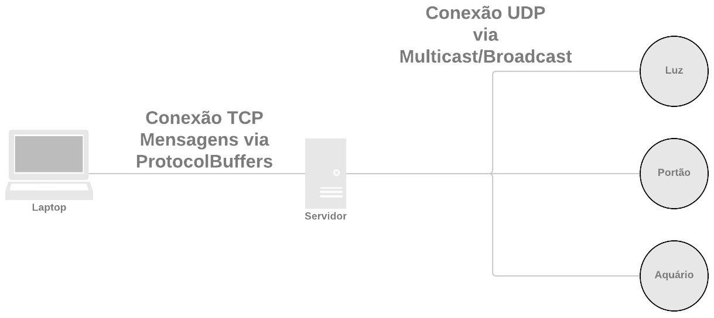
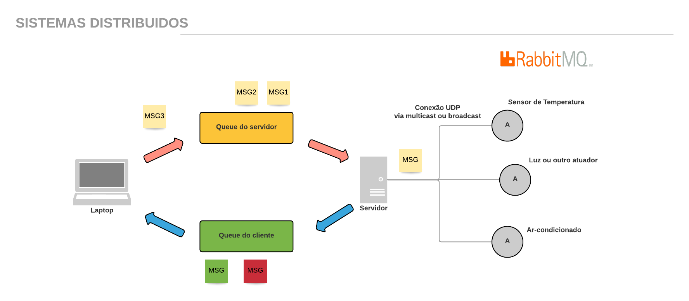

# Trabalho da disciplina de sistemas distribuidos

## Esse arquivo tem como objetivo explicar como a aplicação funciona.

* Servidor
  *  Comunicação 
* Sensores/Processos
* Cliente/Aplicação
* Protocol Buffers

## Linguagens utilizadas
* Python para o servidor e para os sensores
* Ruby para o cliente
  
  
### Servidor 
---
Inicialmente para a comunicação do servidor com os sensores pensamos em usar o o protocolo de comunicação **TCP**, todavia pelo fato do **TCP** ter que fazer o handshake para só depois fazer a troca de mensagens achamos que seria muito lento e além disso teriamos que abrir varias conexões.  Então diante disso utilizamos o **UDP** que apesar de não ser um protocolo "confiavel" ele não precisa fazer o handshake para estabeler conexão, logo só precisamos de um único socket para isso. 

Para fazer essa comunicação com os processos/sensores utilizamos o conceito de thread e isolamos o socket **UDP** do programa principal.Criamos uma classe chamada *Descoberta*. Nessa classe herdamos da classe Thread e dentro dela criamos o socket **UDP** por onde as mensagens dos sensores vão passar.E após criar essa classe instanciamos ela na main. O socket utiliza mensagens **broadcast** para se comunicar com os sensores.

~~~python
class Descoberta(threading.Thread):
  def __init__(self,server,dispositivos,buffer,data):
    threading.Thread.__init__(self)
    self.server = server
    self.dispositivos = dispositivos
    self.buffer = buffer
    self.data = data
  
  def run(self):
    while True:
      try:
        data,address = self.server.recvfrom(1024)
        data = p.loads(data)
        if data[0] == '1':
          if data[1] not in self.dispositivos:
            self.dispositivos.append(data[1])
          elif not data:
            break
        elif data[0] == '2':
          self.buffer.append(data[1])
        elif data[0] == 'data':
          self.data.append(data[1])

      except OSError as msg:
        print(f"Error:{msg}")
      except KeyboardInterrupt:
        print("Finalizando thread...")
        break
~~~

~~~python
#mensagens broadcast do servidor para os sensores
#especificamos a porta e o endereço de broadcast

servidor.sendto(p.dumps(msg), ('<broadcast>',5680))
~~~

#### Comunicação
---
Para a questão da comunicação tentamos padronizar ao máximo as mensagens, para que a aplicação ficasse o mais genêrica possível. Pensando nisso definimos 3 tipos de mensagens para o request e apenas um tipo para o response.

### Request
1. (comando,tipo_da_msg = 'data' ou 'ping' ou '1') 
2. (comando,tipo_da_msg,lista_funçoes_dispositivo,nome_do_dispositivo)
3. (comando,tipo_da_msg,nome_do_dispositivo,nome_da_função,valor)

Para as mensagens de *Request* definimos dois tipos de tipo de mensagens que são as mensagens do tipo '1', que se baseiam em mensagens de ping que seriam as mensagens enviadas para descobrir novos dispositivos e mensagens do tipo dado que seria a mensagens que o sensor que irá ficar enviado dados de X em X tempos enviará. 
O outro tipo seriam as mensagens do tipo '2' que seriam mensagens de requisição de dados dos sensores. Como citado acima essas mensagens tem uns parâmetros a mais, como o nome do dipositivo, pois como o servidor utiliza broadcast o dispositivo cujo o nome está na mensagem irá responder a solicitação.

### Response
1. (tipo_da_msg,dados)

Para as mensagens de *Response* definimos apenas um tipo. Quando os sensores recebem a solicitação eles colocam o tipo da requisição na mensagem de response para que o servidor saiba para onde encaminhar.

### Sensores/Processos
---
Para os sensores/processos a implementação foi simples, de tal forma que elas são bem parecidas com mensagens de get e set. O mais diferenciado entre eles é o *Aquário* que possui uma função de que X em X segundos manda dados para o cliente utilizando um Timer da lib threading.

~~~python
# enviando status
# WAIT = 60 segundos
def status():
  msg = ['data',aquario.get_estado_aquario()]
  cliente.sendto(p.dumps(msg),('',5000))
  threading.Timer(WAIT,status).start()
~~~

### Cliente/Aplicação
---
A implementação do cliente é simples e a troca de mensagens segue os padrões que foram estipulados acima. As resquisições do cliente eram serializadas pelas menssagens do protocol buffers e desesrializadas pelas mesmas que já provinham métodos para isso.

### Protocol Buffers
---
As mensagens *Resquest* e de *Response* foram criadas a partir do arquito .proto do protocol buffers.

~~~

syntax = "proto3";

package distribuidos;

message Request {
  string comando = 1; 
  string tipo_da_msg = 2;
  string nome_do_disp = 3;
  string nome_da_func = 4;
  int32 valor = 5;
}

message Response {
  string tipo_da_msg = 1;
  string conteudo = 2;
}
~~~

# RabbitMq

## Obs 
* Para o RabbitMQ utilizar o app.py

## Linguagem utilizada
* Python
  

## Estratégia
Pegamos a idéia utilizada no modelo original e colocamos o broker, RabbitMQ, para efetuar as transações de mensagens que ocorriam entre a aplicação e o servidor, para dar mais consistência e segurança para a comunicação.

Foi criado um Exchange Default para enviar as solicitações da aplicação para o servidor, e um outro Default para transmitir a resposta do servidor para a aplicação. Enquanto os sensores e o servidor continuam se comunicar via UDP, do mesmo jeito que o modelo original.

